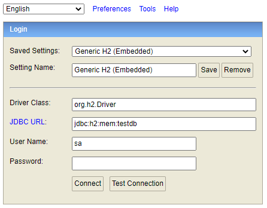

## Point-api 실행 방법 (리눅스 기준)
### 1. 소스 복사
```shell
git clone https://github.com/hyot88/Point-api.git
```

### 2. 복사된 폴더 이동
```shell
cd Point-api
```

### 3. 권한 변경
```shell
chmod +x gradlew
```

### 4. 소스 빌드
```shell
./gradlew build
```

### 5. 빌드 파일 저장된 경로로 이동
```shell
cd ./build/libs
```

### 6. 빌드된 jar 파일 실행
```shell
nohup java -jar Point-api-1.0.0-SNAPSHOT.jar
```

### 7. 브라우저에서 swagger-ui 접속
http://[server-ip]:8088/swagger-ui.html

### 8. H2 Console 접속 방법
http://[server-ip]:8088/h2-console  
